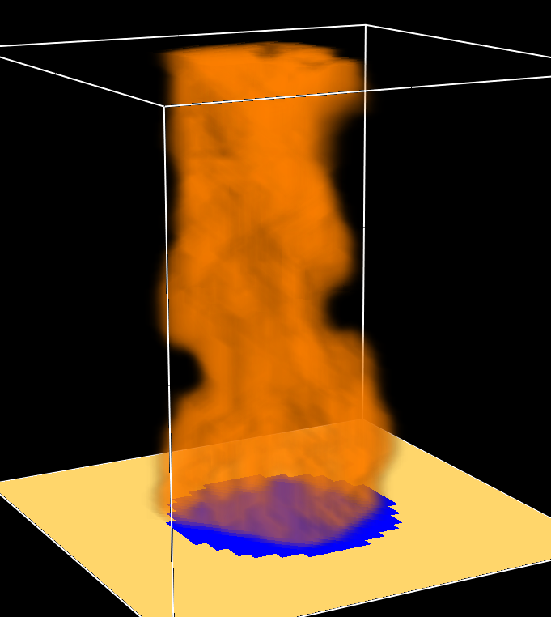

# fds_generator

## Clone the project
```bash
https://github.com/Jacob577/fds_generator.git
```
```bash
pip install freeze
```
Navigate to the project and let's hope the requirements is there
```bash
pip install -r /requirements.txt
```

### Note
You have to have FDS, Python and pip installed. (This is specified due to the audience this project is aimed at might not understand it).


# Multiple runs with fds
There are instances where there is a need to iterate through multiple fds simulations and it can be quite tedious, especially if there are hundreds or even thousands of iterations. Therefore we might just automate it. This project is just to demonstrate how it may look like, you might just close the windows down when they are finished however it is not yet implemented. An easy fix to that problem is to implement some `alt + tab` and `alt + f4` key-presses.

This is a test how to create multiple simulations for further research for wall temperatures thus it can be difficult to estimate through 2-zone models and tedious to setup CFD models for it. 

This specific FDS file is the circular burner from the fire models given when FDS is installed and we iterate through the mass flux of the circular burner from 0.01 to 0.05 kg/m2.


